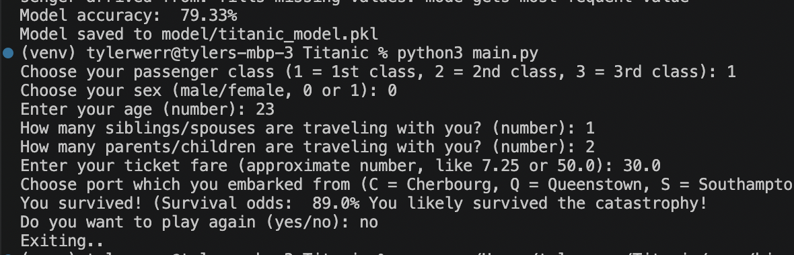
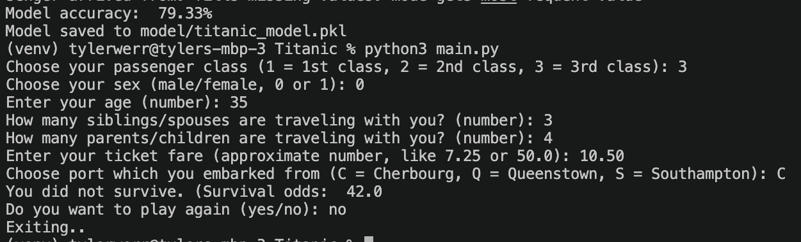

# Titanic Survival Prediction Simulator

An interactive machine learning simulation that predicts Titanic passenger survival probability using a trained Random Forest classification model. Users input passenger characteristics such as age, sex, ticket class, and fare information, and the application predicts whether the passenger would likely survive based on historical Titanic dataset patterns.

---

## Features

- Interactive command-line prediction system
- Machine learning model trained using Titanic passenger data
- Random Forest classification model
- User input preprocessing and feature handling
- Prediction logging to CSV for analysis
- Persistent trained model using Joblib
- Real-world dataset integration using Pandas and Scikit-learn

---

## Tech Stack

- Python
- Pandas
- Scikit-learn
- Joblib
- CSV Data Processing

---

## Project Structure

```text
Titanic/
│
├── data/
│   ├── train.csv
│   ├── test.csv
│   └── gender_submission.csv
│
├── model/
│   └── titanic_model.pkl
│
├── train_model.py
├── main.py
├── logger.py
├── game_log.csv
└── README.md
```

---

## How It Works

1. The machine learning model is trained using historical Titanic passenger data.
2. Users enter passenger information such as:
   - Passenger class
   - Sex
   - Age
   - Number of siblings/spouses
   - Number of parents/children
   - Fare amount
   - Embarkation port
3. The trained Random Forest model evaluates the inputs and predicts survival probability.
4. Prediction results are logged into a CSV file for tracking and analysis.

---

## How To Run

### 1. Install Dependencies

```bash
pip install pandas scikit-learn joblib
```

### 2. Train the Model

```bash
python train_model.py
```

### 3. Run the Simulation

```bash
python main.py
```

---

## Example Prediction Inputs

- Passenger Class: 1
- Sex: Female
- Age: 28
- Fare: 80
- Embarked: C

The application predicts whether the passenger would likely survive based on learned historical patterns.

---
## Screenshot
- Survived Output


- Death Output



## Learning Objectives

This project demonstrates:

- Supervised machine learning workflows
- Classification model training
- Data preprocessing
- User input handling
- Model serialization
- Real-world dataset analysis
- Python application structure

---

## Future Improvements

- Add graphical user interface (GUI)
- Display survival probability percentages
- Add feature importance visualization
- Deploy as a web application
- Support additional machine learning models

---

## Dataset

Dataset based on the Titanic passenger survival dataset commonly used for machine learning classification tasks.

---